# Comprehensive Model-assisted QCVV Report

This report summarizes both the **pipeline** and **individual** trained artifacts. It treats the trained CT-HMM/CNN-GRU/HSMM/DMM outputs as model-assisted QCVV estimators for hidden parity/loop states, readout confidence, state-transition behavior, dwell diagnostics, and bundle-to-bundle robustness.

## Executive interpretation

- **Pipeline** is the connected QCVV workflow: CT-HMM teacher, neural decoders, HSMM duration check, DMM sequence model, and exports.

- **Individual** is the independent baseline/ablation bundle: useful for checking whether the pipeline values are stable and whether teacher assistance improves downstream models.

- The values here are **model-derived QCVV characterization metrics**, not physical certification. Physical QCVV needs raw data, physical timing, calibration labels, and repeated-readout experiments.

## QCVV model-readiness scorecard

This score combines artifact completeness, CT-HMM lifetime availability, prediction-model availability, within-bundle model agreement, and prediction confidence. It is **not** readout fidelity.

| bundle     | family   |   qcvv_model_readiness_score_0_to_100 | interpretation                         | has_cthmm_lifetimes   | has_multiple_prediction_models   |   mean_within_bundle_agreement |   best_model_confidence |   n_prediction_models |
|:-----------|:---------|--------------------------------------:|:---------------------------------------|:----------------------|:---------------------------------|-------------------------------:|------------------------:|----------------------:|
| individual | parity   |                               99.5549 | strong model-assisted characterization | True                  | True                             |                       0.985288 |                0.996909 |                     2 |
| pipeline   | parity   |                               95.6118 | strong model-assisted characterization | True                  | True                             |                       0.825181 |                0.999291 |                     5 |
| individual | x_loop   |                               85.2299 | strong model-assisted characterization | True                  | True                             |                       0.802437 |                0.60676  |                     2 |
| pipeline   | x_loop   |                               78.6701 | usable model-assisted characterization | True                  | True                             |                       0.539942 |                0.60686  |                     5 |
| individual | z_loop   |                               94.2669 | strong model-assisted characterization | True                  | True                             |                       0.961402 |                0.809275 |                     2 |
| pipeline   | z_loop   |                               88.7213 | strong model-assisted characterization | True                  | True                             |                       0.738524 |                0.810327 |                     5 |

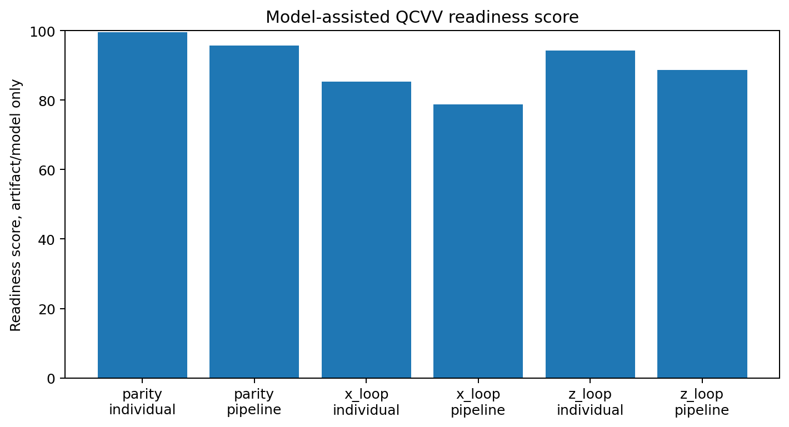

## Artifact inventory

| bundle     | family   | stage                        | model               | prediction_npz                                                                                                                           | qcvv_summary_json                                                                                | summary_json                                                                                                     | metrics_json                                                                                                   | metrics_csv                                                                                                     | has_checkpoint   |
|:-----------|:---------|:-----------------------------|:--------------------|:-----------------------------------------------------------------------------------------------------------------------------------------|:-------------------------------------------------------------------------------------------------|:-----------------------------------------------------------------------------------------------------------------|:---------------------------------------------------------------------------------------------------------------|:----------------------------------------------------------------------------------------------------------------|:-----------------|
| individual | parity   | cnn_gru                      | cnn_gru_independent | nan                                                                                                                                      | nan                                                                                              | individual\individual\parity\cnn_gru\20260504_232607_cnn_gru_together_parity_run\summary.json                    | nan                                                                                                            | individual\individual\parity\cnn_gru\20260504_232607_cnn_gru_together_parity_run\metrics.csv                    | True             |
| individual | parity   | cthmm                        | gpu_cthmm           | individual\individual\parity\cthmm\20260504_230557_cthmm_together_parity_run\teacher_predictions.npz                                     | individual\individual\parity\cthmm\20260504_230557_cthmm_together_parity_run\qcvv_summary.json   | nan                                                                                                              | nan                                                                                                            | nan                                                                                                             | False            |
| individual | parity   | dmm                          | dmm                 | nan                                                                                                                                      | nan                                                                                              | individual\individual\parity\dmm\20260504_235429_dmm_together_parity_run\summary.json                            | nan                                                                                                            | individual\individual\parity\dmm\20260504_235429_dmm_together_parity_run\metrics.csv                            | True             |
| individual | parity   | hsmm                         | gpu_hsmm_duration   | individual\individual\parity\hsmm\20260504_233338_hsmm_together_parity_run\hsmm_predictions.npz                                          | nan                                                                                              | nan                                                                                                              | individual\individual\parity\hsmm\20260504_233338_hsmm_together_parity_run\metrics.json                        | nan                                                                                                             | True             |
| individual | x_loop   | cnn_gru                      | cnn_gru_independent | nan                                                                                                                                      | nan                                                                                              | individual\individual\x_loop\cnn_gru\20260505_015100_cnn_gru_together_x_loop_run\summary.json                    | nan                                                                                                            | individual\individual\x_loop\cnn_gru\20260505_015100_cnn_gru_together_x_loop_run\metrics.csv                    | True             |
| individual | x_loop   | cthmm                        | gpu_cthmm           | individual\individual\x_loop\cthmm\20260505_014342_cthmm_together_x_loop_run\teacher_predictions.npz                                     | individual\individual\x_loop\cthmm\20260505_014342_cthmm_together_x_loop_run\qcvv_summary.json   | nan                                                                                                              | nan                                                                                                            | nan                                                                                                             | False            |
| individual | x_loop   | dmm                          | dmm                 | nan                                                                                                                                      | nan                                                                                              | individual\individual\x_loop\dmm\20260505_020443_dmm_together_x_loop_run\summary.json                            | nan                                                                                                            | individual\individual\x_loop\dmm\20260505_020443_dmm_together_x_loop_run\metrics.csv                            | True             |
| individual | x_loop   | hsmm                         | gpu_hsmm_duration   | individual\individual\x_loop\hsmm\20260505_015629_hsmm_together_x_loop_run\hsmm_predictions.npz                                          | nan                                                                                              | nan                                                                                                              | individual\individual\x_loop\hsmm\20260505_015629_hsmm_together_x_loop_run\metrics.json                        | nan                                                                                                             | True             |
| individual | z_loop   | cnn_gru                      | cnn_gru_independent | nan                                                                                                                                      | nan                                                                                              | individual\individual\z_loop\cnn_gru\20260505_024601_cnn_gru_together_z_loop_run\summary.json                    | nan                                                                                                            | individual\individual\z_loop\cnn_gru\20260505_024601_cnn_gru_together_z_loop_run\metrics.csv                    | True             |
| individual | z_loop   | cthmm                        | gpu_cthmm           | individual\individual\z_loop\cthmm\20260505_024243_cthmm_together_z_loop_run\teacher_predictions.npz                                     | individual\individual\z_loop\cthmm\20260505_024243_cthmm_together_z_loop_run\qcvv_summary.json   | nan                                                                                                              | nan                                                                                                            | nan                                                                                                             | False            |
| individual | z_loop   | dmm                          | dmm                 | nan                                                                                                                                      | nan                                                                                              | individual\individual\z_loop\dmm\20260505_025258_dmm_together_z_loop_run\summary.json                            | nan                                                                                                            | individual\individual\z_loop\dmm\20260505_025258_dmm_together_z_loop_run\metrics.csv                            | True             |
| individual | z_loop   | hsmm                         | gpu_hsmm_duration   | individual\individual\z_loop\hsmm\20260505_024835_hsmm_together_z_loop_run\hsmm_predictions.npz                                          | nan                                                                                              | nan                                                                                                              | individual\individual\z_loop\hsmm\20260505_024835_hsmm_together_z_loop_run\metrics.json                        | nan                                                                                                             | True             |
| pipeline   | parity   | 01_cthmm                     | gpu_cthmm           | pipeline\pipeline\parity\01_cthmm\20260505_025817_cthmm_together_parity_family\teacher_predictions.npz                                   | pipeline\pipeline\parity\01_cthmm\20260505_025817_cthmm_together_parity_family\qcvv_summary.json | nan                                                                                                              | nan                                                                                                            | nan                                                                                                             | False            |
| pipeline   | parity   | 02_cnn_gru_independent       | cnn_gru             | pipeline\pipeline\parity\02_cnn_gru_independent\20260505_031909_cnn_gru_together_parity_family\predictions_cnn_independent.npz           | nan                                                                                              | pipeline\pipeline\parity\02_cnn_gru_independent\20260505_031909_cnn_gru_together_parity_family\summary.json      | nan                                                                                                            | pipeline\pipeline\parity\02_cnn_gru_independent\20260505_031909_cnn_gru_together_parity_family\metrics.csv      | True             |
| pipeline   | parity   | 03_cnn_gru_teacher_assisted  | cnn_gru             | pipeline\pipeline\parity\03_cnn_gru_teacher_assisted\20260505_032709_cnn_gru_together_parity_family\predictions_cnn_teacher_assisted.npz | nan                                                                                              | pipeline\pipeline\parity\03_cnn_gru_teacher_assisted\20260505_032709_cnn_gru_together_parity_family\summary.json | nan                                                                                                            | pipeline\pipeline\parity\03_cnn_gru_teacher_assisted\20260505_032709_cnn_gru_together_parity_family\metrics.csv | True             |
| pipeline   | parity   | 04_hsmm_using_cnn_embeddings | gpu_hsmm_duration   | pipeline\pipeline\parity\04_hsmm_using_cnn_embeddings\20260505_034648_hsmm_together_parity_family\hsmm_predictions.npz                   | nan                                                                                              | nan                                                                                                              | pipeline\pipeline\parity\04_hsmm_using_cnn_embeddings\20260505_034648_hsmm_together_parity_family\metrics.json | nan                                                                                                             | True             |
| pipeline   | parity   | 05_dmm                       | dmm                 | pipeline\pipeline\parity\05_dmm\20260505_040832_dmm_together_parity_family\predictions_dmm.npz                                           | nan                                                                                              | pipeline\pipeline\parity\05_dmm\20260505_040832_dmm_together_parity_family\summary.json                          | nan                                                                                                            | pipeline\pipeline\parity\05_dmm\20260505_040832_dmm_together_parity_family\metrics.csv                          | True             |
| pipeline   | parity   | 06_export_predictions        | exported            | nan                                                                                                                                      | nan                                                                                              | nan                                                                                                              | nan                                                                                                            | nan                                                                                                             | False            |
| pipeline   | x_loop   | 01_cthmm                     | gpu_cthmm           | pipeline\pipeline\x_loop\01_cthmm\20260505_091222_cthmm_together_x_loop_family\teacher_predictions.npz                                   | pipeline\pipeline\x_loop\01_cthmm\20260505_091222_cthmm_together_x_loop_family\qcvv_summary.json | nan                                                                                                              | nan                                                                                                            | nan                                                                                                             | False            |
| pipeline   | x_loop   | 02_cnn_gru_independent       | cnn_gru             | pipeline\pipeline\x_loop\02_cnn_gru_independent\20260505_092006_cnn_gru_together_x_loop_family\predictions_cnn_independent.npz           | nan                                                                                              | pipeline\pipeline\x_loop\02_cnn_gru_independent\20260505_092006_cnn_gru_together_x_loop_family\summary.json      | nan                                                                                                            | pipeline\pipeline\x_loop\02_cnn_gru_independent\20260505_092006_cnn_gru_together_x_loop_family\metrics.csv      | True             |
| pipeline   | x_loop   | 03_cnn_gru_teacher_assisted  | cnn_gru             | pipeline\pipeline\x_loop\03_cnn_gru_teacher_assisted\20260505_092550_cnn_gru_together_x_loop_family\predictions_cnn_teacher_assisted.npz | nan                                                                                              | pipeline\pipeline\x_loop\03_cnn_gru_teacher_assisted\20260505_092550_cnn_gru_together_x_loop_family\summary.json | nan                                                                                                            | pipeline\pipeline\x_loop\03_cnn_gru_teacher_assisted\20260505_092550_cnn_gru_together_x_loop_family\metrics.csv | True             |
| pipeline   | x_loop   | 04_hsmm_using_cnn_embeddings | gpu_hsmm_duration   | pipeline\pipeline\x_loop\04_hsmm_using_cnn_embeddings\20260505_093246_hsmm_together_x_loop_family\hsmm_predictions.npz                   | nan                                                                                              | nan                                                                                                              | pipeline\pipeline\x_loop\04_hsmm_using_cnn_embeddings\20260505_093246_hsmm_together_x_loop_family\metrics.json | nan                                                                                                             | True             |
| pipeline   | x_loop   | 05_dmm                       | dmm                 | pipeline\pipeline\x_loop\05_dmm\20260505_094130_dmm_together_x_loop_family\predictions_dmm.npz                                           | nan                                                                                              | pipeline\pipeline\x_loop\05_dmm\20260505_094130_dmm_together_x_loop_family\summary.json                          | nan                                                                                                            | pipeline\pipeline\x_loop\05_dmm\20260505_094130_dmm_together_x_loop_family\metrics.csv                          | True             |
| pipeline   | x_loop   | 06_export_predictions        | exported            | nan                                                                                                                                      | nan                                                                                              | nan                                                                                                              | nan                                                                                                            | nan                                                                                                             | False            |
| pipeline   | z_loop   | 01_cthmm                     | gpu_cthmm           | pipeline\pipeline\z_loop\01_cthmm\20260505_102554_cthmm_together_z_loop_family\teacher_predictions.npz                                   | pipeline\pipeline\z_loop\01_cthmm\20260505_102554_cthmm_together_z_loop_family\qcvv_summary.json | nan                                                                                                              | nan                                                                                                            | nan                                                                                                             | False            |
| pipeline   | z_loop   | 02_cnn_gru_independent       | cnn_gru             | pipeline\pipeline\z_loop\02_cnn_gru_independent\20260505_102929_cnn_gru_together_z_loop_family\predictions_cnn_independent.npz           | nan                                                                                              | pipeline\pipeline\z_loop\02_cnn_gru_independent\20260505_102929_cnn_gru_together_z_loop_family\summary.json      | nan                                                                                                            | pipeline\pipeline\z_loop\02_cnn_gru_independent\20260505_102929_cnn_gru_together_z_loop_family\metrics.csv      | True             |
| pipeline   | z_loop   | 03_cnn_gru_teacher_assisted  | cnn_gru             | pipeline\pipeline\z_loop\03_cnn_gru_teacher_assisted\20260505_103215_cnn_gru_together_z_loop_family\predictions_cnn_teacher_assisted.npz | nan                                                                                              | pipeline\pipeline\z_loop\03_cnn_gru_teacher_assisted\20260505_103215_cnn_gru_together_z_loop_family\summary.json | nan                                                                                                            | pipeline\pipeline\z_loop\03_cnn_gru_teacher_assisted\20260505_103215_cnn_gru_together_z_loop_family\metrics.csv | True             |
| pipeline   | z_loop   | 04_hsmm_using_cnn_embeddings | gpu_hsmm_duration   | pipeline\pipeline\z_loop\04_hsmm_using_cnn_embeddings\20260505_103411_hsmm_together_z_loop_family\hsmm_predictions.npz                   | nan                                                                                              | nan                                                                                                              | pipeline\pipeline\z_loop\04_hsmm_using_cnn_embeddings\20260505_103411_hsmm_together_z_loop_family\metrics.json | nan                                                                                                             | True             |
| pipeline   | z_loop   | 05_dmm                       | dmm                 | pipeline\pipeline\z_loop\05_dmm\20260505_103853_dmm_together_z_loop_family\predictions_dmm.npz                                           | nan                                                                                              | pipeline\pipeline\z_loop\05_dmm\20260505_103853_dmm_together_z_loop_family\summary.json                          | nan                                                                                                            | pipeline\pipeline\z_loop\05_dmm\20260505_103853_dmm_together_z_loop_family\metrics.csv                          | True             |
| pipeline   | z_loop   | 06_export_predictions        | exported            | nan                                                                                                                                      | nan                                                                                              | nan                                                                                                              | nan                                                                                                            | nan                                                                                                             | False            |

## CT-HMM rates and effective lifetimes

CT-HMM lifetime values are the main interpretable lifetime extraction. They are in model units unless `--dt-json` was supplied.

| bundle     | family   | model     |     gamma_01 |     gamma_10 |   tau_0_model_units |   tau_1_model_units |   tau_mean_model_units |   tau_asymmetry_tau0_over_tau1 | tau_mean_physical   |   train_log_likelihood_per_obs |
|:-----------|:---------|:----------|-------------:|-------------:|--------------------:|--------------------:|-----------------------:|-------------------------------:|:--------------------|-------------------------------:|
| individual | parity   | gpu_cthmm |      2.47621 |      4.96012 |         0.403844    |         0.201608    |            0.302726    |                        2.00311 | N/A                 |                       -13.4066 |
| pipeline   | parity   | gpu_cthmm |      2.49686 |      5.01121 |         0.400503    |         0.199552    |            0.300028    |                        2.00701 | N/A                 |                       -13.4076 |
| individual | x_loop   | gpu_cthmm | 355266       | 390658       |         2.81479e-06 |         2.55978e-06 |            2.68729e-06 |                        1.09962 | N/A                 |                       -11.3288 |
| pipeline   | x_loop   | gpu_cthmm | 355508       | 390136       |         2.81288e-06 |         2.56321e-06 |            2.68804e-06 |                        1.0974  | N/A                 |                       -11.3295 |
| individual | z_loop   | gpu_cthmm |   1795.29    |   2939.4     |         0.000557015 |         0.000340206 |            0.00044861  |                        1.63729 | N/A                 |                       -10.5347 |
| pipeline   | z_loop   | gpu_cthmm |   1789.43    |   2938.97    |         0.000558838 |         0.000340256 |            0.000449547 |                        1.64241 | N/A                 |                       -10.5321 |

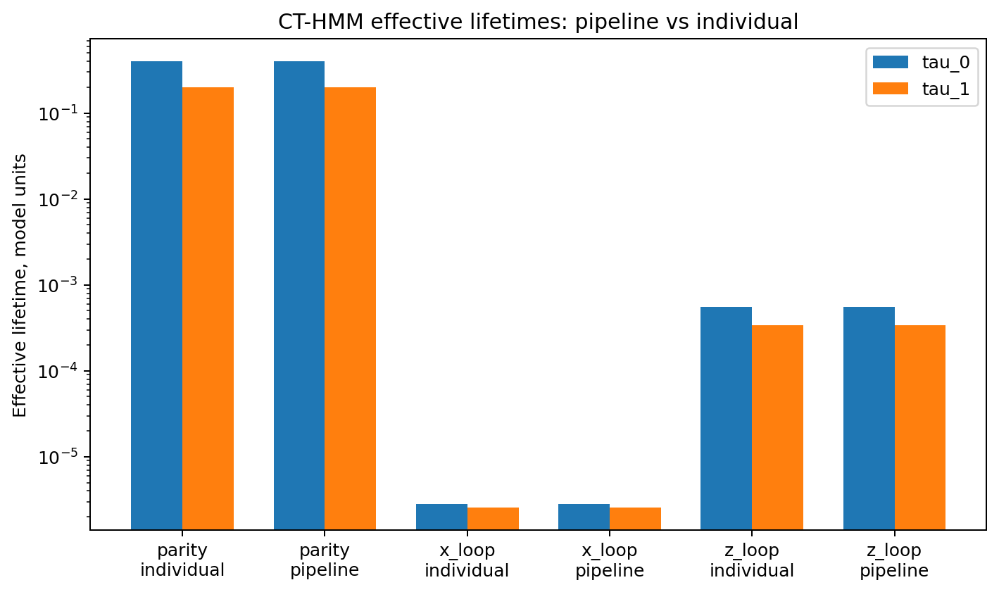

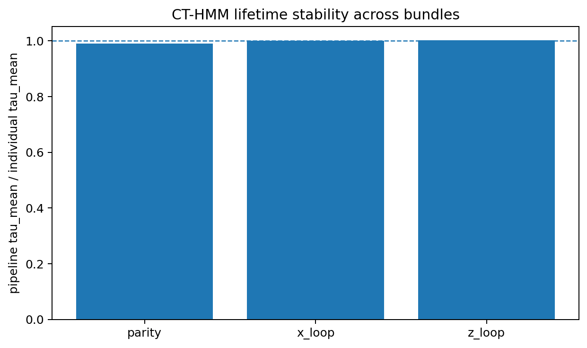

## Family-level summary

| bundle     | family   |   n_cthmm_lifetime_rows |   n_prediction_models |   mean_prediction_confidence |   mean_prediction_entropy_bits |   mean_within_bundle_agreement |   mean_cross_bundle_same_model_agreement |   cthmm_tau_mean_model_units |
|:-----------|:---------|------------------------:|----------------------:|-----------------------------:|-------------------------------:|-------------------------------:|-----------------------------------------:|-----------------------------:|
| individual | parity   |                       1 |                     2 |                     0.996909 |                       0.01064  |                       0.985288 |                                 0.999979 |                  0.302726    |
| pipeline   | parity   |                       1 |                     5 |                     0.855559 |                       0.323871 |                       0.825181 |                                 0.999979 |                  0.300028    |
| individual | x_loop   |                       1 |                     2 |                     0.60676  |                       0.949439 |                       0.802437 |                                 0.996269 |                  2.68729e-06 |
| pipeline   | x_loop   |                       1 |                     5 |                     0.554863 |                       0.977257 |                       0.539942 |                                 0.996269 |                  2.68804e-06 |
| individual | z_loop   |                       1 |                     2 |                     0.809275 |                       0.617635 |                       0.961402 |                                 0.998735 |                  0.00044861  |
| pipeline   | z_loop   |                       1 |                     5 |                     0.680487 |                       0.819518 |                       0.738524 |                                 0.998735 |                  0.000449547 |

## Prediction metrics

These metrics summarize decoder probability/confidence and inferred hidden-state occupancy. They are useful for model diagnostics, but they are not assignment fidelity without physical labels.

| bundle     | family   | model             |   n_predictions | mean_confidence   | median_confidence   | mean_entropy_bits   |   state_0_occupancy |   state_1_occupancy | window_switch_rate   | n_sequences   |
|:-----------|:---------|:------------------|----------------:|:------------------|:--------------------|:--------------------|--------------------:|--------------------:|:---------------------|:--------------|
| individual | parity   | gpu_cthmm         |          701480 | 0.996909          | 1                   | 0.01064             |            0.642105 |         0.357895    | N/A                  | N/A           |
| individual | parity   | gpu_hsmm_duration |          105220 | N/A               | N/A                 | N/A                 |            0.630764 |         0.369236    | 0                    | 6.701000e+04  |
| pipeline   | parity   | cnn_gru           |          701480 | 0.508904          | 0.508778            | 0.999766            |            0.999999 |         1.42556e-06 | 3.925448e-06         | 4.467320e+05  |
| pipeline   | parity   | cnn_gru           |          701480 | 0.917133          | 0.983703            | 0.28233             |            0.632015 |         0.367985    | 0.0880478            | 4.467320e+05  |
| pipeline   | parity   | dmm               |          701480 | 0.999291          | 1                   | 0.00274044          |            0.636915 |         0.363085    | 0.00241415           | 4.467320e+05  |
| pipeline   | parity   | gpu_cthmm         |          701480 | 0.996908          | 1                   | 0.010646            |            0.642105 |         0.357895    | N/A                  | N/A           |
| pipeline   | parity   | gpu_hsmm_duration |           70174 | N/A               | N/A                 | N/A                 |            0.631473 |         0.368527    | 0                    | 4.467400e+04  |
| individual | x_loop   | gpu_cthmm         |          186000 | 0.60676           | 0.594773            | 0.949439            |            0.505091 |         0.494909    | N/A                  | N/A           |
| individual | x_loop   | gpu_hsmm_duration |           27900 | N/A               | N/A                 | N/A                 |            0.318495 |         0.681505    | 0.0757879            | 930           |
| pipeline   | x_loop   | cnn_gru           |          186000 | 0.504268          | 0.504373            | 0.99994             |            0.999548 |         0.000451613 | 6.451613e-04         | 6200          |
| pipeline   | x_loop   | cnn_gru           |          186000 | 0.59407           | 0.580284            | 0.960332            |            0.478957 |         0.521043    | 0.0588265            | 6200          |
| pipeline   | x_loop   | dmm               |          186000 | 0.514256          | 0.514439            | 0.999397            |            0        |         1           | 0                    | 6200          |
| pipeline   | x_loop   | gpu_cthmm         |          186000 | 0.60686           | 0.59482             | 0.949358            |            0.508844 |         0.491156    | N/A                  | N/A           |
| pipeline   | x_loop   | gpu_hsmm_duration |           18600 | N/A               | N/A                 | N/A                 |            0.297796 |         0.702204    | 0.0730812            | 620           |
| individual | z_loop   | gpu_cthmm         |           15015 | 0.809275          | 0.83709             | 0.617635            |            0.609391 |         0.390609    | N/A                  | N/A           |
| individual | z_loop   | gpu_hsmm_duration |            2254 | N/A               | N/A                 | N/A                 |            0.636202 |         0.363798    | 0.0714286            | 322           |
| pipeline   | z_loop   | cnn_gru           |           15015 | 0.50724           | 0.507699            | 0.999837            |            0.97982  |         0.0201798   | 0.0222222            | 2145          |
| pipeline   | z_loop   | cnn_gru           |           15015 | 0.725435          | 0.742388            | 0.804769            |            0.482318 |         0.517682    | 0.0731935            | 2145          |
| pipeline   | z_loop   | dmm               |           15015 | 0.678947          | 0.665636            | 0.85881             |            0.53966  |         0.46034     | 0.0670552            | 2145          |
| pipeline   | z_loop   | gpu_cthmm         |           15015 | 0.810327          | 0.838229            | 0.614654            |            0.60686  |         0.39314     | N/A                  | N/A           |
| pipeline   | z_loop   | gpu_hsmm_duration |            1505 | N/A               | N/A                 | N/A                 |            0.661794 |         0.338206    | 0.0635659            | 215           |

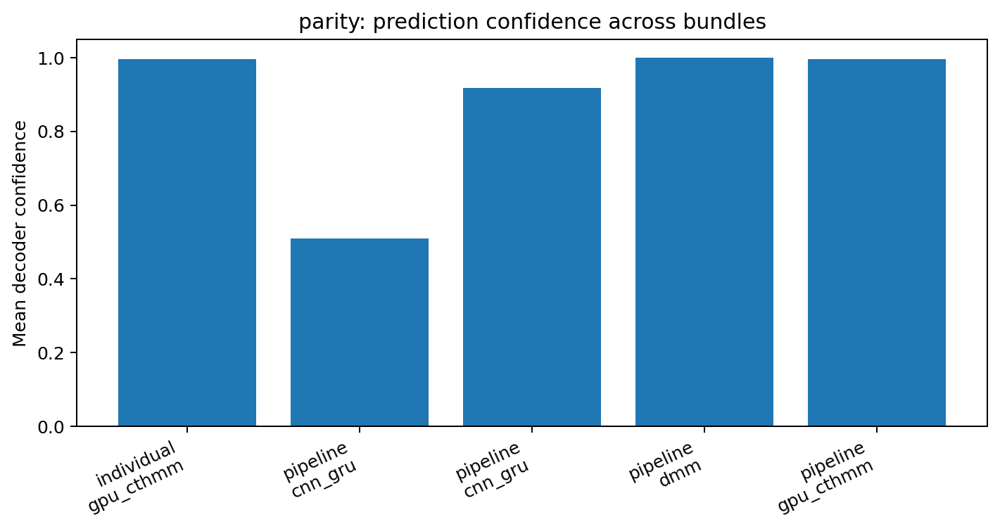

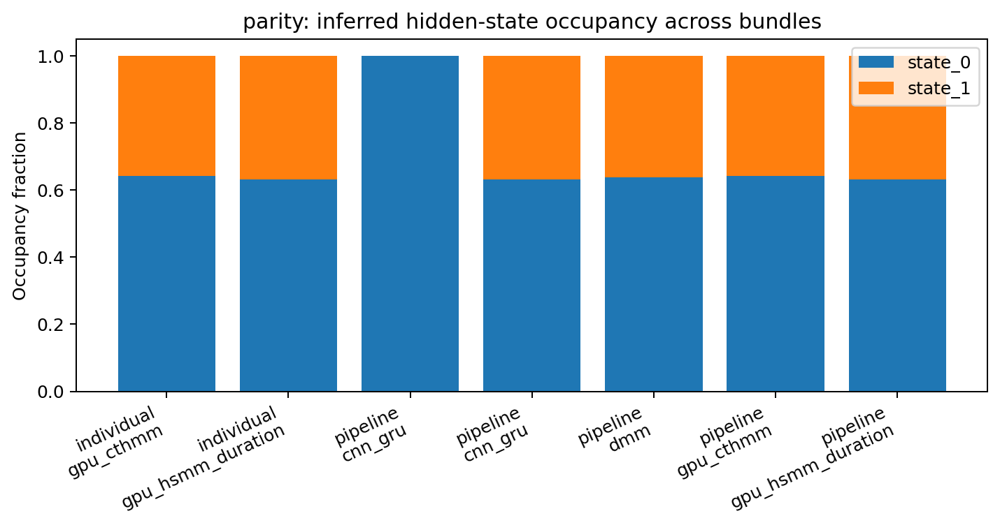

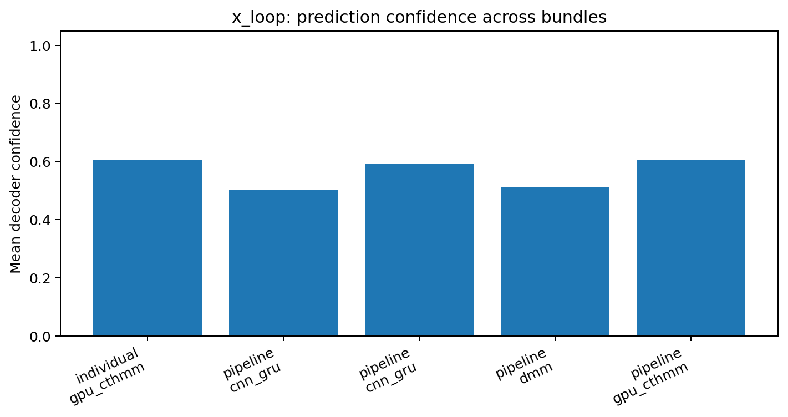

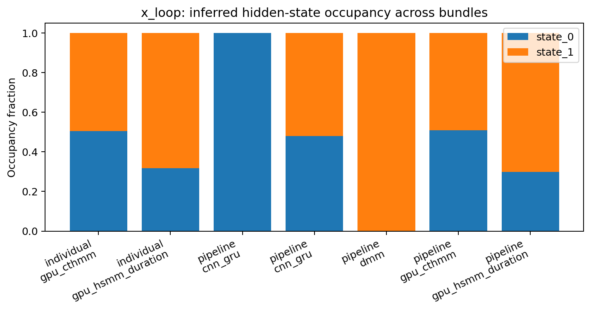

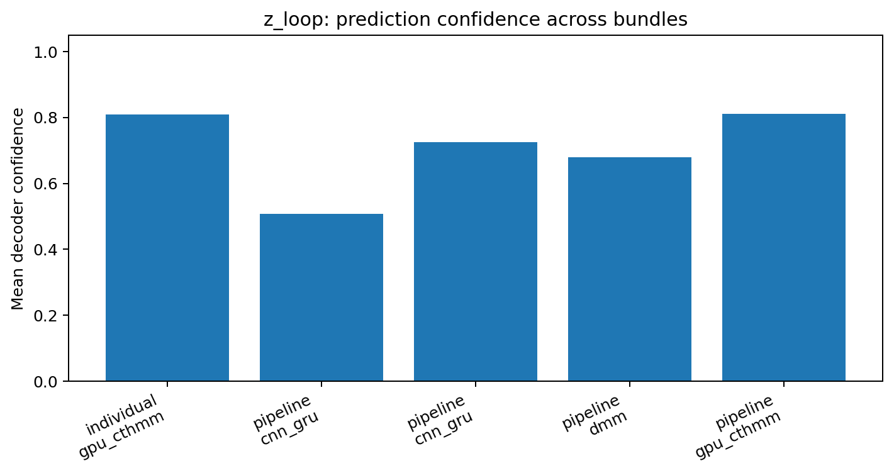

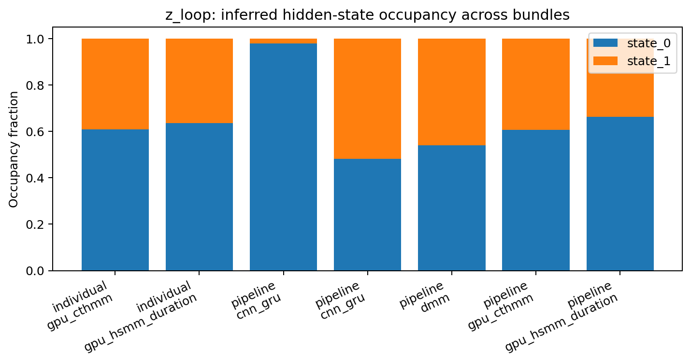

## Highest-confidence prediction model by bundle/family

| bundle     | family   | model     |   mean_confidence |   mean_entropy_bits |   state_0_occupancy |   state_1_occupancy | source_file                                                                                            |
|:-----------|:---------|:----------|------------------:|--------------------:|--------------------:|--------------------:|:-------------------------------------------------------------------------------------------------------|
| individual | parity   | gpu_cthmm |          0.996909 |          0.01064    |            0.642105 |            0.357895 | individual\individual\parity\cthmm\20260504_230557_cthmm_together_parity_run\teacher_predictions.npz   |
| pipeline   | parity   | dmm       |          0.999291 |          0.00274044 |            0.636915 |            0.363085 | pipeline\pipeline\parity\05_dmm\20260505_040832_dmm_together_parity_family\predictions_dmm.npz         |
| individual | x_loop   | gpu_cthmm |          0.60676  |          0.949439   |            0.505091 |            0.494909 | individual\individual\x_loop\cthmm\20260505_014342_cthmm_together_x_loop_run\teacher_predictions.npz   |
| pipeline   | x_loop   | gpu_cthmm |          0.60686  |          0.949358   |            0.508844 |            0.491156 | pipeline\pipeline\x_loop\01_cthmm\20260505_091222_cthmm_together_x_loop_family\teacher_predictions.npz |
| individual | z_loop   | gpu_cthmm |          0.809275 |          0.617635   |            0.609391 |            0.390609 | individual\individual\z_loop\cthmm\20260505_024243_cthmm_together_z_loop_run\teacher_predictions.npz   |
| pipeline   | z_loop   | gpu_cthmm |          0.810327 |          0.614654   |            0.60686  |            0.39314  | pipeline\pipeline\z_loop\01_cthmm\20260505_102554_cthmm_together_z_loop_family\teacher_predictions.npz |

## Within-bundle model agreement

Agreement compares hard hidden-state calls between models in the same bundle/family. High agreement indicates model consistency, not necessarily physical correctness.

| bundle     | family   | left_model        | right_model       |   n_aligned | alignment    |   hard_state_agreement | js_divergence_bits   | mean_l1_probability_distance   |
|:-----------|:---------|:------------------|:------------------|------------:|:-------------|-----------------------:|:---------------------|:-------------------------------|
| individual | parity   | gpu_cthmm         | gpu_hsmm_duration |      105220 | sample_index |            0.985288    | N/A                  | N/A                            |
| pipeline   | parity   | cnn_gru           | cnn_gru           |      701480 | sample_index |            0.632014    | 0.213912             | 0.828383                       |
| pipeline   | parity   | cnn_gru           | dmm               |      701480 | sample_index |            0.636916    | 0.30798              | 0.992575                       |
| pipeline   | parity   | cnn_gru           | dmm               |      701480 | sample_index |            0.919087    | 0.0762672            | 0.236464                       |
| pipeline   | parity   | cnn_gru           | gpu_hsmm_duration |       70174 | sample_index |            0.631473    | N/A                  | N/A                            |
| pipeline   | parity   | cnn_gru           | gpu_hsmm_duration |       70174 | sample_index |            0.908271    | N/A                  | N/A                            |
| pipeline   | parity   | gpu_cthmm         | cnn_gru           |      701480 | sample_index |            0.642107    | 0.305262             | 0.98754                        |
| pipeline   | parity   | gpu_cthmm         | cnn_gru           |      701480 | sample_index |            0.913945    | 0.0796085            | 0.245709                       |
| pipeline   | parity   | gpu_cthmm         | dmm               |      701480 | sample_index |            0.994071    | 0.00404676           | 0.0123966                      |
| pipeline   | parity   | gpu_cthmm         | gpu_hsmm_duration |       70174 | sample_index |            0.985237    | N/A                  | N/A                            |
| pipeline   | parity   | gpu_hsmm_duration | dmm               |       70174 | sample_index |            0.988685    | N/A                  | N/A                            |
| individual | x_loop   | gpu_cthmm         | gpu_hsmm_duration |       27900 | sample_index |            0.802437    | N/A                  | N/A                            |
| pipeline   | x_loop   | cnn_gru           | cnn_gru           |      186000 | sample_index |            0.478892    | 0.0100908            | 0.188655                       |
| pipeline   | x_loop   | cnn_gru           | dmm               |      186000 | sample_index |            0.000451613 | 2.564957e-04         | 0.0370471                      |
| pipeline   | x_loop   | cnn_gru           | dmm               |      186000 | sample_index |            0.521043    | 0.0102247            | 0.188162                       |
| pipeline   | x_loop   | cnn_gru           | gpu_hsmm_duration |       18600 | sample_index |            0.298065    | N/A                  | N/A                            |
| pipeline   | x_loop   | cnn_gru           | gpu_hsmm_duration |       18600 | sample_index |            0.787581    | N/A                  | N/A                            |
| pipeline   | x_loop   | gpu_cthmm         | cnn_gru           |      186000 | sample_index |            0.508887    | 0.0129602            | 0.213675                       |
| pipeline   | x_loop   | gpu_cthmm         | cnn_gru           |      186000 | sample_index |            0.816737    | 0.00395724           | 0.115618                       |
| pipeline   | x_loop   | gpu_cthmm         | dmm               |      186000 | sample_index |            0.491156    | 0.013095             | 0.215139                       |
| pipeline   | x_loop   | gpu_cthmm         | gpu_hsmm_duration |       18600 | sample_index |            0.794409    | N/A                  | N/A                            |
| pipeline   | x_loop   | gpu_hsmm_duration | dmm               |       18600 | sample_index |            0.702204    | N/A                  | N/A                            |
| individual | z_loop   | gpu_cthmm         | gpu_hsmm_duration |        2254 | sample_index |            0.961402    | N/A                  | N/A                            |
| pipeline   | z_loop   | cnn_gru           | cnn_gru           |       15015 | sample_index |            0.502498    | 0.0512915            | 0.449881                       |
| pipeline   | z_loop   | cnn_gru           | dmm               |       15015 | sample_index |            0.55984     | 0.0365418            | 0.355268                       |
| pipeline   | z_loop   | cnn_gru           | dmm               |       15015 | sample_index |            0.914419    | 0.00779461           | 0.141904                       |
| pipeline   | z_loop   | cnn_gru           | gpu_hsmm_duration |        1505 | sample_index |            0.688372    | N/A                  | N/A                            |
| pipeline   | z_loop   | cnn_gru           | gpu_hsmm_duration |        1505 | sample_index |            0.748173    | N/A                  | N/A                            |
| pipeline   | z_loop   | gpu_cthmm         | cnn_gru           |       15015 | sample_index |            0.626906    | 0.108025             | 0.616093                       |
| pipeline   | z_loop   | gpu_cthmm         | cnn_gru           |       15015 | sample_index |            0.773693    | 0.0690451            | 0.404149                       |
| pipeline   | z_loop   | gpu_cthmm         | dmm               |       15015 | sample_index |            0.818515    | 0.0601247            | 0.375339                       |
| pipeline   | z_loop   | gpu_cthmm         | gpu_hsmm_duration |        1505 | sample_index |            0.966113    | N/A                  | N/A                            |
| pipeline   | z_loop   | gpu_hsmm_duration | dmm               |        1505 | sample_index |            0.786711    | N/A                  | N/A                            |

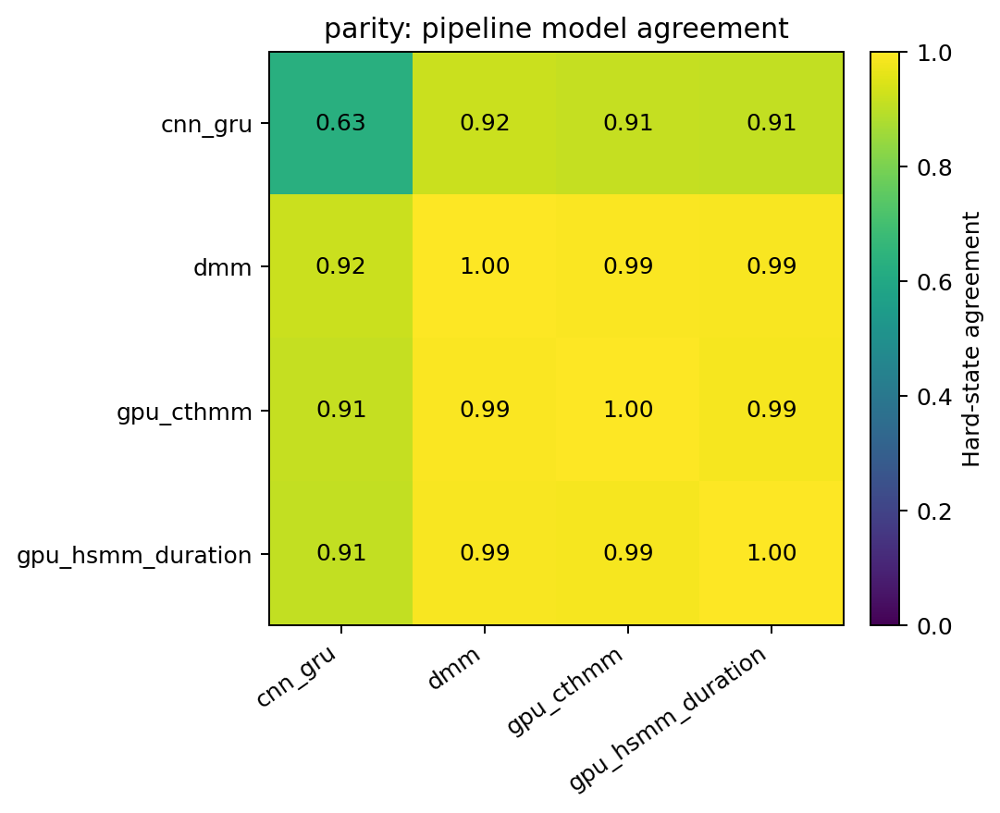

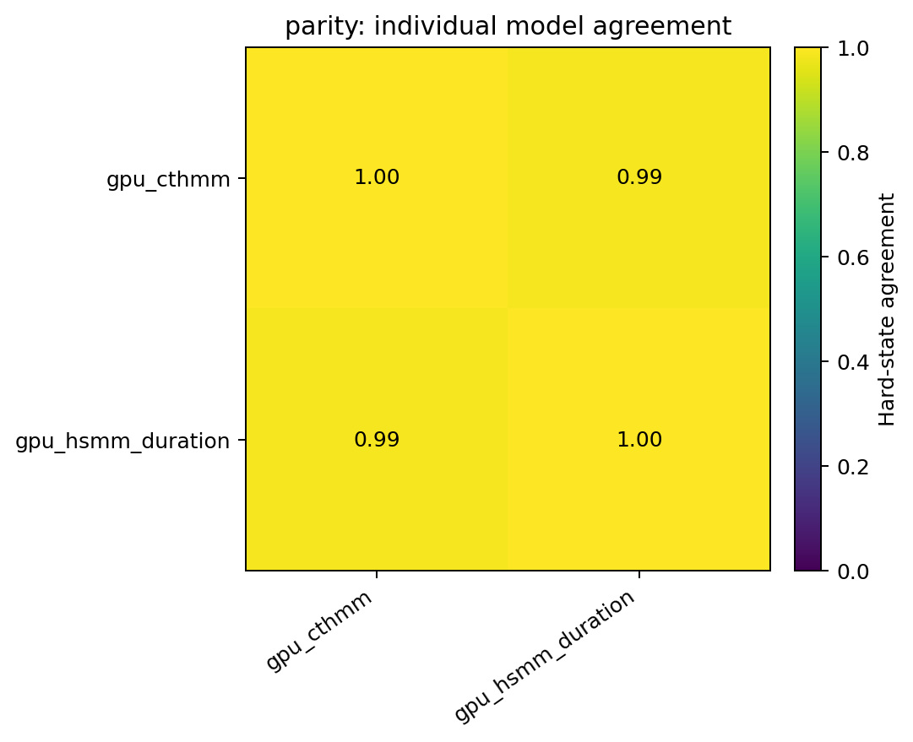

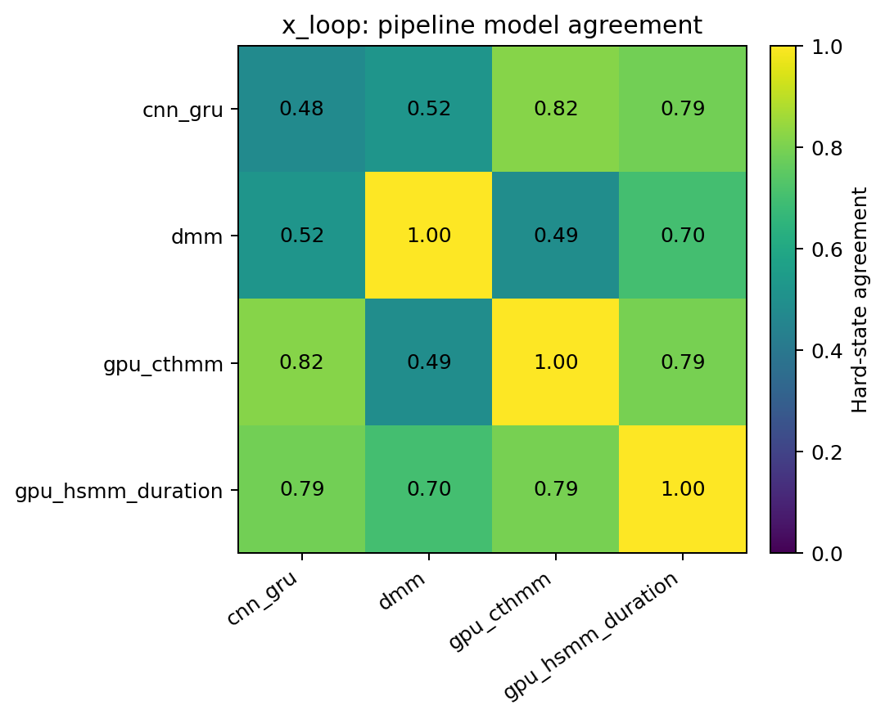

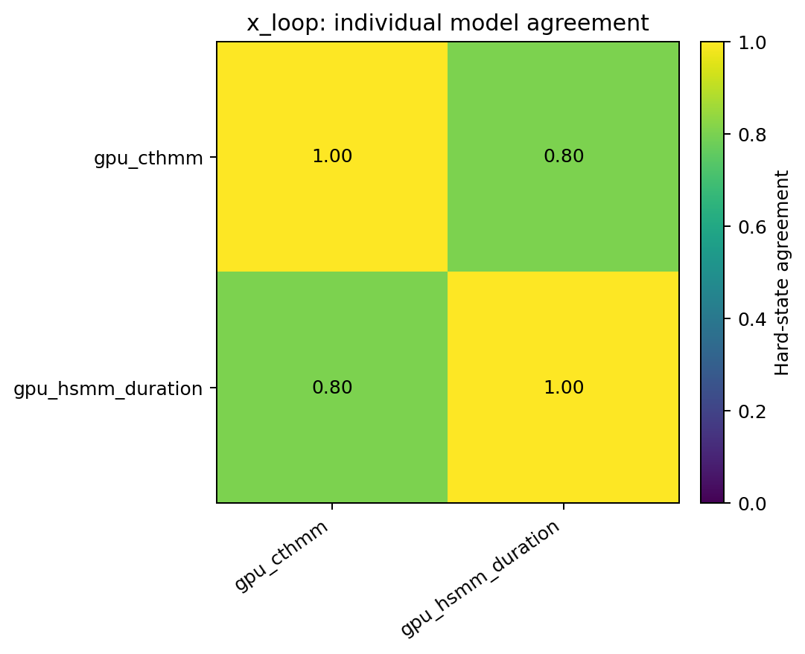

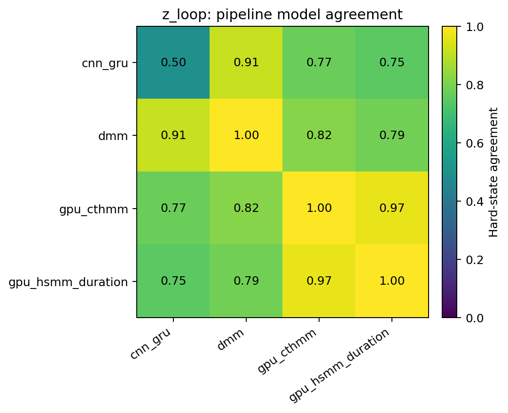

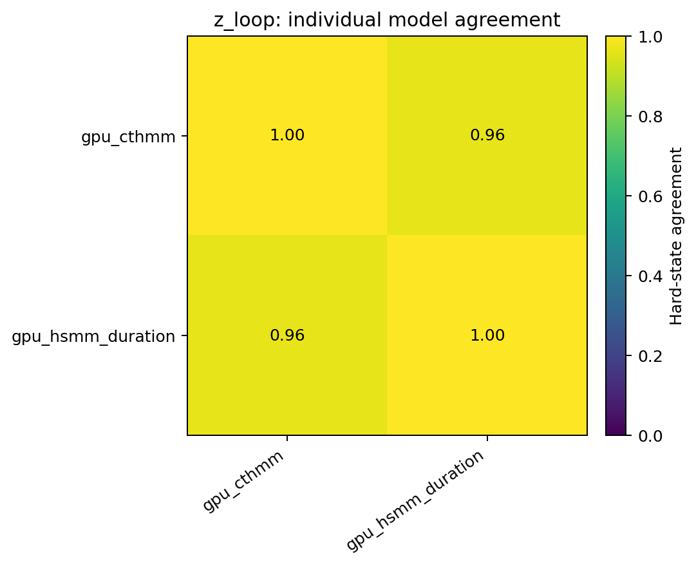

## Cross-bundle same-model agreement

This section compares pipeline vs individual predictions for the same family/model when both bundles contain prediction `.npz` files. Some individual neural baselines currently have checkpoints and training metrics but no exported predictions, so they cannot appear here until predictions are exported.

| family   | left_model        | right_model       |   n_aligned | alignment    |   hard_state_agreement | js_divergence_bits   | mean_l1_probability_distance   |
|:---------|:------------------|:------------------|------------:|:-------------|-----------------------:|:---------------------|:-------------------------------|
| parity   | gpu_cthmm         | gpu_cthmm         |      701480 | sample_index |               1        | 2.411550e-09         | 2.388325e-06                   |
| parity   | gpu_hsmm_duration | gpu_hsmm_duration |       70174 | sample_index |               0.999957 | N/A                  | N/A                            |
| x_loop   | gpu_cthmm         | gpu_cthmm         |      186000 | sample_index |               0.996247 | 1.246147e-06         | 0.00252337                     |
| x_loop   | gpu_hsmm_duration | gpu_hsmm_duration |       18600 | sample_index |               0.99629  | N/A                  | N/A                            |
| z_loop   | gpu_cthmm         | gpu_cthmm         |       15015 | sample_index |               0.997469 | 1.370498e-05         | 0.00530149                     |
| z_loop   | gpu_hsmm_duration | gpu_hsmm_duration |        1505 | sample_index |               1        | N/A                  | N/A                            |

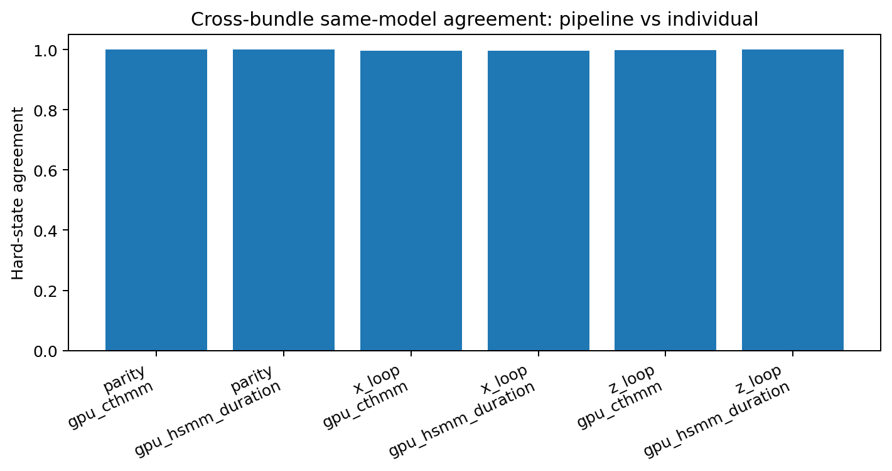

## Bundle comparison metrics

These are direct pipeline-vs-individual deltas/ratios for matched family/model metrics. Ratios near 1 indicate stable extractions across the two workflows.

| comparison_type    | family   | model             | metric                       |   pipeline_value |   individual_value |   absolute_delta_pipeline_minus_individual | ratio_pipeline_over_individual   |
|:-------------------|:---------|:------------------|:-----------------------------|-----------------:|-------------------:|-------------------------------------------:|:---------------------------------|
| cthmm_lifetimes    | parity   | gpu_cthmm         | gamma_01                     |      2.49686     |        2.47621     |                                0.0206518   | 1.00834                          |
| cthmm_lifetimes    | parity   | gpu_cthmm         | gamma_10                     |      5.01121     |        4.96012     |                                0.0510941   | 1.0103                           |
| cthmm_lifetimes    | parity   | gpu_cthmm         | tau_0_model_units            |      0.400503    |        0.403844    |                               -0.00334024  | 0.991729                         |
| cthmm_lifetimes    | parity   | gpu_cthmm         | tau_1_model_units            |      0.199552    |        0.201608    |                               -0.00205559  | 0.989804                         |
| cthmm_lifetimes    | parity   | gpu_cthmm         | tau_asymmetry_tau0_over_tau1 |      2.00701     |        2.00311     |                                0.00389536  | 1.00194                          |
| cthmm_lifetimes    | parity   | gpu_cthmm         | tau_mean_model_units         |      0.300028    |        0.302726    |                               -0.00269791  | 0.991088                         |
| cthmm_lifetimes    | parity   | gpu_cthmm         | train_log_likelihood_per_obs |    -13.4076      |      -13.4066      |                               -0.00101215  | 1.00008                          |
| cthmm_lifetimes    | x_loop   | gpu_cthmm         | gamma_01                     | 355508           |   355266           |                              242           | 1.00068                          |
| cthmm_lifetimes    | x_loop   | gpu_cthmm         | gamma_10                     | 390136           |   390658           |                             -521.75        | 0.998664                         |
| cthmm_lifetimes    | x_loop   | gpu_cthmm         | tau_0_model_units            |      2.81288e-06 |        2.81479e-06 |                               -1.91607e-09 | 0.999319                         |
| cthmm_lifetimes    | x_loop   | gpu_cthmm         | tau_1_model_units            |      2.56321e-06 |        2.55978e-06 |                                3.42334e-09 | 1.00134                          |
| cthmm_lifetimes    | x_loop   | gpu_cthmm         | tau_asymmetry_tau0_over_tau1 |      1.0974      |        1.09962     |                               -0.00221615  | 0.997985                         |
| cthmm_lifetimes    | x_loop   | gpu_cthmm         | tau_mean_model_units         |      2.68804e-06 |        2.68729e-06 |                                7.53632e-10 | 1.00028                          |
| cthmm_lifetimes    | x_loop   | gpu_cthmm         | train_log_likelihood_per_obs |    -11.3295      |      -11.3288      |                               -0.00068809  | 1.00006                          |
| cthmm_lifetimes    | z_loop   | gpu_cthmm         | gamma_01                     |   1789.43        |     1795.29        |                               -5.85901     | 0.996736                         |
| cthmm_lifetimes    | z_loop   | gpu_cthmm         | gamma_10                     |   2938.97        |     2939.4         |                               -0.430176    | 0.999854                         |
| cthmm_lifetimes    | z_loop   | gpu_cthmm         | tau_0_model_units            |      0.000558838 |        0.000557015 |                                1.8238e-06  | 1.00327                          |
| cthmm_lifetimes    | z_loop   | gpu_cthmm         | tau_1_model_units            |      0.000340256 |        0.000340206 |                                4.97958e-08 | 1.00015                          |
| cthmm_lifetimes    | z_loop   | gpu_cthmm         | tau_asymmetry_tau0_over_tau1 |      1.64241     |        1.63729     |                                0.00512047  | 1.00313                          |
| cthmm_lifetimes    | z_loop   | gpu_cthmm         | tau_mean_model_units         |      0.000449547 |        0.00044861  |                                9.36797e-07 | 1.00209                          |
| cthmm_lifetimes    | z_loop   | gpu_cthmm         | train_log_likelihood_per_obs |    -10.5321      |      -10.5347      |                                0.00261654  | 0.999752                         |
| prediction_metrics | parity   | gpu_cthmm         | mean_confidence              |      0.996908    |        0.996909    |                               -8.37099e-07 | 0.999999                         |
| prediction_metrics | parity   | gpu_cthmm         | mean_entropy_bits            |      0.010646    |        0.01064     |                                5.90211e-06 | 1.00055                          |
| prediction_metrics | parity   | gpu_cthmm         | median_confidence            |      1           |        1           |                                0           | 1                                |
| prediction_metrics | parity   | gpu_cthmm         | n_predictions                | 701480           |   701480           |                                0           | 1                                |
| prediction_metrics | parity   | gpu_cthmm         | state_0_occupancy            |      0.642105    |        0.642105    |                                0           | 1                                |
| prediction_metrics | parity   | gpu_cthmm         | state_1_occupancy            |      0.357895    |        0.357895    |                                0           | 1                                |
| prediction_metrics | parity   | gpu_hsmm_duration | n_predictions                |  70174           |   105220           |                           -35046           | 0.666926                         |
| prediction_metrics | parity   | gpu_hsmm_duration | state_0_occupancy            |      0.631473    |        0.630764    |                                0.000709082 | 1.00112                          |
| prediction_metrics | parity   | gpu_hsmm_duration | state_1_occupancy            |      0.368527    |        0.369236    |                               -0.000709082 | 0.99808                          |
| prediction_metrics | parity   | gpu_hsmm_duration | window_switch_rate           |      0           |        0           |                                0           | N/A                              |
| prediction_metrics | x_loop   | gpu_cthmm         | mean_confidence              |      0.60686     |        0.60676     |                                0.000100163 | 1.00017                          |
| prediction_metrics | x_loop   | gpu_cthmm         | mean_entropy_bits            |      0.949358    |        0.949439    |                               -8.11022e-05 | 0.999915                         |
| prediction_metrics | x_loop   | gpu_cthmm         | median_confidence            |      0.59482     |        0.594773    |                                4.68194e-05 | 1.00008                          |
| prediction_metrics | x_loop   | gpu_cthmm         | n_predictions                | 186000           |   186000           |                                0           | 1                                |
| prediction_metrics | x_loop   | gpu_cthmm         | state_0_occupancy            |      0.508844    |        0.505091    |                                0.00375269  | 1.00743                          |
| prediction_metrics | x_loop   | gpu_cthmm         | state_1_occupancy            |      0.491156    |        0.494909    |                               -0.00375269  | 0.992417                         |
| prediction_metrics | x_loop   | gpu_hsmm_duration | n_predictions                |  18600           |    27900           |                            -9300           | 0.666667                         |
| prediction_metrics | x_loop   | gpu_hsmm_duration | state_0_occupancy            |      0.297796    |        0.318495    |                               -0.0206989   | 0.93501                          |
| prediction_metrics | x_loop   | gpu_hsmm_duration | state_1_occupancy            |      0.702204    |        0.681505    |                                0.0206989   | 1.03037                          |
| prediction_metrics | x_loop   | gpu_hsmm_duration | window_switch_rate           |      0.0730812   |        0.0757879   |                               -0.00270671  | 0.964286                         |
| prediction_metrics | z_loop   | gpu_cthmm         | mean_confidence              |      0.810327    |        0.809275    |                                0.00105195  | 1.0013                           |
| prediction_metrics | z_loop   | gpu_cthmm         | mean_entropy_bits            |      0.614654    |        0.617635    |                               -0.0029809   | 0.995174                         |
| prediction_metrics | z_loop   | gpu_cthmm         | median_confidence            |      0.838229    |        0.83709     |                                0.00113887  | 1.00136                          |
| prediction_metrics | z_loop   | gpu_cthmm         | n_predictions                |  15015           |    15015           |                                0           | 1                                |
| prediction_metrics | z_loop   | gpu_cthmm         | state_0_occupancy            |      0.60686     |        0.609391    |                               -0.0025308   | 0.995847                         |
| prediction_metrics | z_loop   | gpu_cthmm         | state_1_occupancy            |      0.39314     |        0.390609    |                                0.0025308   | 1.00648                          |
| prediction_metrics | z_loop   | gpu_hsmm_duration | n_predictions                |   1505           |     2254           |                             -749           | 0.667702                         |
| prediction_metrics | z_loop   | gpu_hsmm_duration | state_0_occupancy            |      0.661794    |        0.636202    |                                0.0255917   | 1.04023                          |
| prediction_metrics | z_loop   | gpu_hsmm_duration | state_1_occupancy            |      0.338206    |        0.363798    |                               -0.0255917   | 0.929654                         |
| prediction_metrics | z_loop   | gpu_hsmm_duration | window_switch_rate           |      0.0635659   |        0.0714286   |                               -0.00786268  | 0.889922                         |
| training_metrics   | parity   | dmm               | best_selection_score         |      0.999366    |       -0.0280766   |                                1.02744     | -35.5942                         |
| training_metrics   | parity   | dmm               | best_val_loss                |      0.0304098   |        0.0280766   |                                0.00233317  | 1.0831                           |
| training_metrics   | parity   | dmm               | last_train_loss              |      0.0562215   |        0.0390683   |                                0.0171532   | 1.43906                          |
| training_metrics   | parity   | dmm               | last_val_loss                |      0.0304098   |        0.0282866   |                                0.00212323  | 1.07506                          |
| training_metrics   | parity   | dmm               | test_loss                    |      0.0303994   |        0.0280639   |                                0.00233552  | 1.08322                          |
| training_metrics   | x_loop   | dmm               | best_selection_score         |     -0.0280512   |       -0.0281504   |                                9.92376e-05 | 0.996475                         |
| training_metrics   | x_loop   | dmm               | best_val_loss                |      0.0280512   |        0.0281504   |                               -9.92376e-05 | 0.996475                         |
| training_metrics   | x_loop   | dmm               | last_train_loss              |      0.0392559   |        0.0390028   |                                0.000253059 | 1.00649                          |
| training_metrics   | x_loop   | dmm               | last_val_loss                |      0.0282548   |        0.0281748   |                                7.9995e-05  | 1.00284                          |
| training_metrics   | x_loop   | dmm               | test_loss                    |      0.0280408   |        0.0281345   |                               -9.37977e-05 | 0.996666                         |
| training_metrics   | z_loop   | dmm               | best_selection_score         |      0.89359     |       -0.0302746   |                                0.923865    | -29.5162                         |
| training_metrics   | z_loop   | dmm               | best_val_loss                |      0.0372501   |        0.0302746   |                                0.00697552  | 1.23041                          |
| training_metrics   | z_loop   | dmm               | last_train_loss              |      0.0573416   |        0.0486203   |                                0.00872128  | 1.17938                          |
| training_metrics   | z_loop   | dmm               | last_val_loss                |      0.0372501   |        0.0302746   |                                0.00697552  | 1.23041                          |
| training_metrics   | z_loop   | dmm               | test_loss                    |      0.0373044   |        0.0303076   |                                0.00699674  | 1.23086                          |

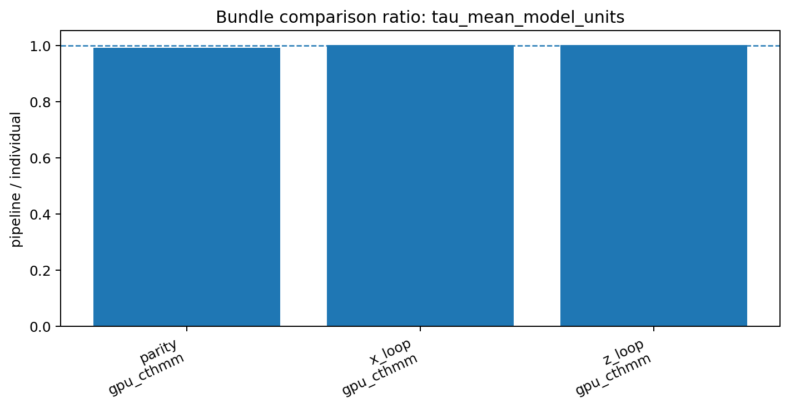

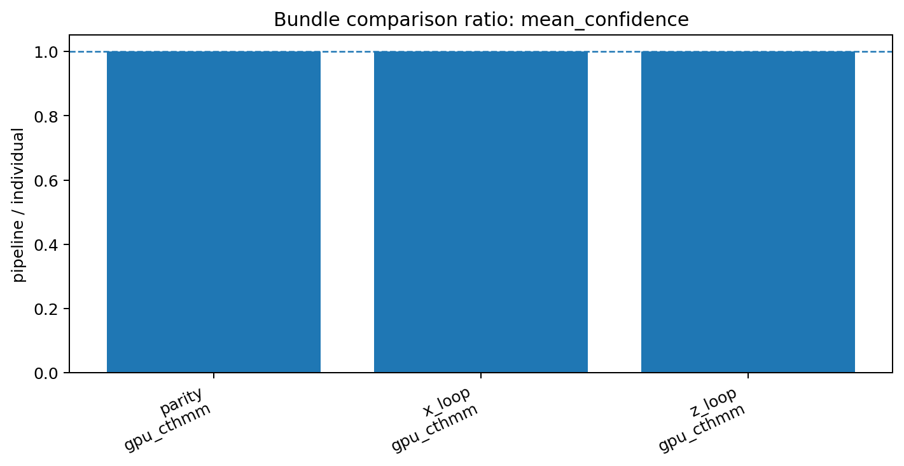

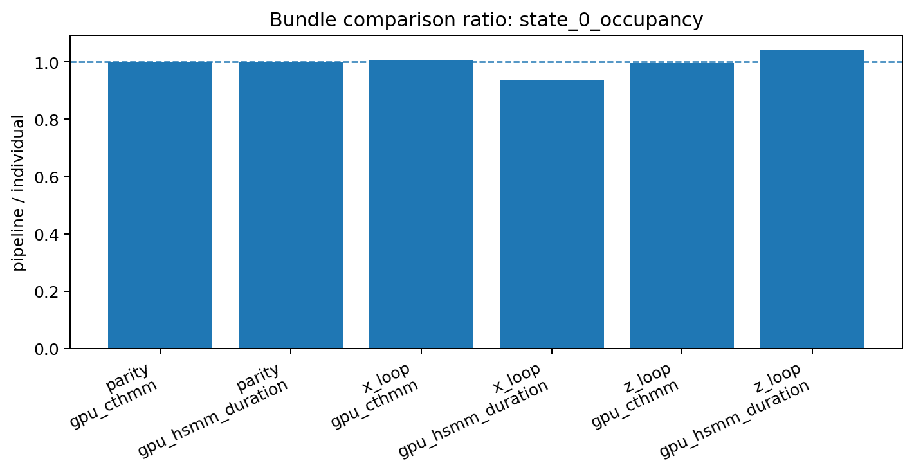

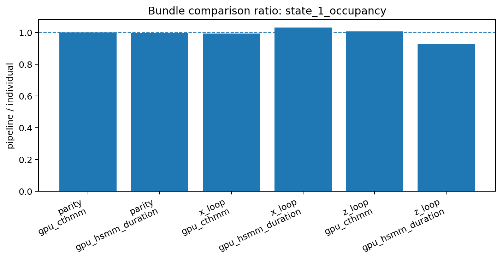

## Dwell diagnostics

Dwell metrics are computed from prediction-window state runs when `sequence_id` exists. They are a diagnostic for duration/non-Markovian behavior, not a replacement for raw-trace dwell analysis.

| bundle     | family   | model             |   state |   n_dwell_segments |   mean_dwell_windows |   median_dwell_windows |   p90_dwell_windows |   max_dwell_windows |
|:-----------|:---------|:------------------|--------:|-------------------:|---------------------:|-----------------------:|--------------------:|--------------------:|
| individual | parity   | gpu_hsmm_duration |       0 |              47080 |              1.40971 |                      1 |                   2 |                   2 |
| individual | parity   | gpu_hsmm_duration |       1 |              19930 |              1.94937 |                      2 |                   2 |                   2 |
| pipeline   | parity   | cnn_gru           |       0 |             446732 |              1.57025 |                      2 |                   2 |                   2 |
| pipeline   | parity   | cnn_gru           |       0 |             328795 |              1.3484  |                      1 |                   2 |                   2 |
| pipeline   | parity   | cnn_gru           |       1 |                  1 |              1       |                      1 |                   1 |                   1 |
| pipeline   | parity   | cnn_gru           |       1 |             140367 |              1.83899 |                      2 |                   2 |                   2 |
| pipeline   | parity   | dmm               |       0 |             319688 |              1.39756 |                      1 |                   2 |                   2 |
| pipeline   | parity   | dmm               |       1 |             127659 |              1.99514 |                      2 |                   2 |                   2 |
| pipeline   | parity   | gpu_hsmm_duration |       0 |              31395 |              1.41147 |                      1 |                   2 |                   2 |
| pipeline   | parity   | gpu_hsmm_duration |       1 |              13279 |              1.94751 |                      2 |                   2 |                   2 |
| individual | x_loop   | gpu_hsmm_duration |       0 |               1316 |              6.75228 |                      3 |                  23 |                  30 |
| individual | x_loop   | gpu_hsmm_duration |       1 |               1658 |             11.468   |                      5 |                  30 |                  30 |
| pipeline   | x_loop   | cnn_gru           |       0 |               6255 |             29.7228  |                     30 |                  30 |                  30 |
| pipeline   | x_loop   | cnn_gru           |       0 |               8245 |             10.8049  |                      3 |                  30 |                  30 |
| pipeline   | x_loop   | cnn_gru           |       1 |                 61 |              1.37705 |                      1 |                   2 |                   4 |
| pipeline   | x_loop   | cnn_gru           |       1 |               8532 |             11.3589  |                      4 |                  30 |                  30 |
| pipeline   | x_loop   | dmm               |       1 |               6200 |             30       |                     30 |                  30 |                  30 |
| pipeline   | x_loop   | gpu_hsmm_duration |       0 |                835 |              6.63353 |                      3 |                  21 |                  30 |
| pipeline   | x_loop   | gpu_hsmm_duration |       1 |               1099 |             11.8844  |                      6 |                  30 |                  30 |
| individual | z_loop   | gpu_hsmm_duration |       0 |                269 |              5.33086 |                      7 |                   7 |                   7 |
| individual | z_loop   | gpu_hsmm_duration |       1 |                191 |              4.29319 |                      4 |                   7 |                   7 |
| pipeline   | z_loop   | cnn_gru           |       0 |               2244 |              6.55615 |                      7 |                   7 |                   7 |
| pipeline   | z_loop   | cnn_gru           |       0 |               1503 |              4.81836 |                      7 |                   7 |                   7 |
| pipeline   | z_loop   | cnn_gru           |       1 |                187 |              1.62032 |                      1 |                   3 |                   6 |
| pipeline   | z_loop   | cnn_gru           |       1 |               1584 |              4.9072  |                      7 |                   7 |                   7 |
| pipeline   | z_loop   | dmm               |       0 |               1589 |              5.09943 |                      7 |                   7 |                   7 |
| pipeline   | z_loop   | dmm               |       1 |               1419 |              4.87104 |                      7 |                   7 |                   7 |
| pipeline   | z_loop   | gpu_hsmm_duration |       0 |                181 |              5.50276 |                      7 |                   7 |                   7 |
| pipeline   | z_loop   | gpu_hsmm_duration |       1 |                116 |              4.38793 |                      4 |                   7 |                   7 |

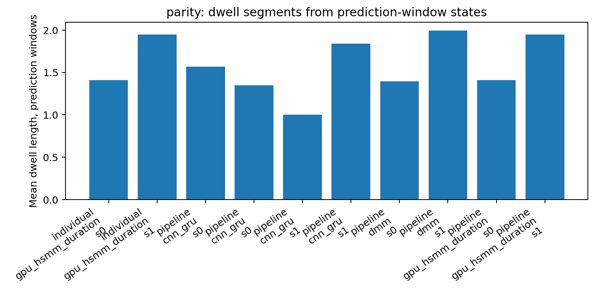

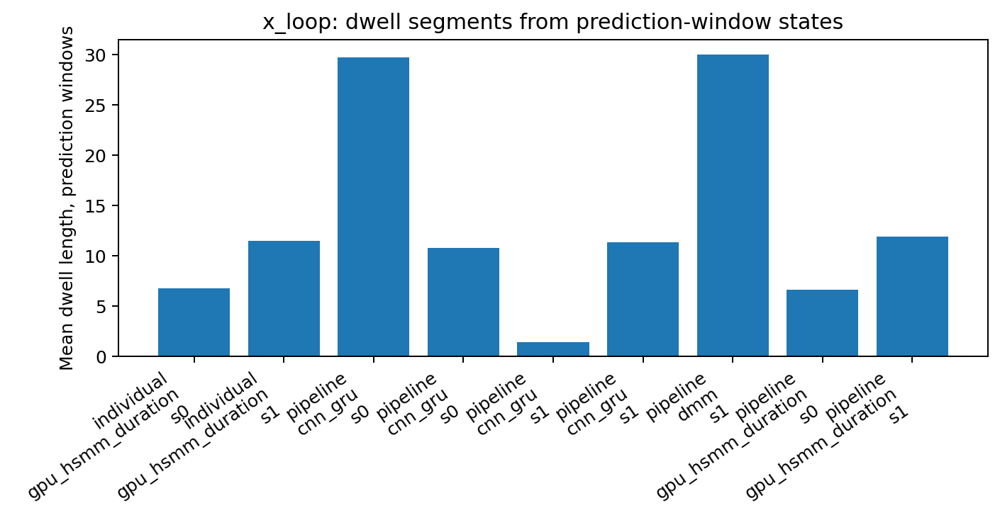

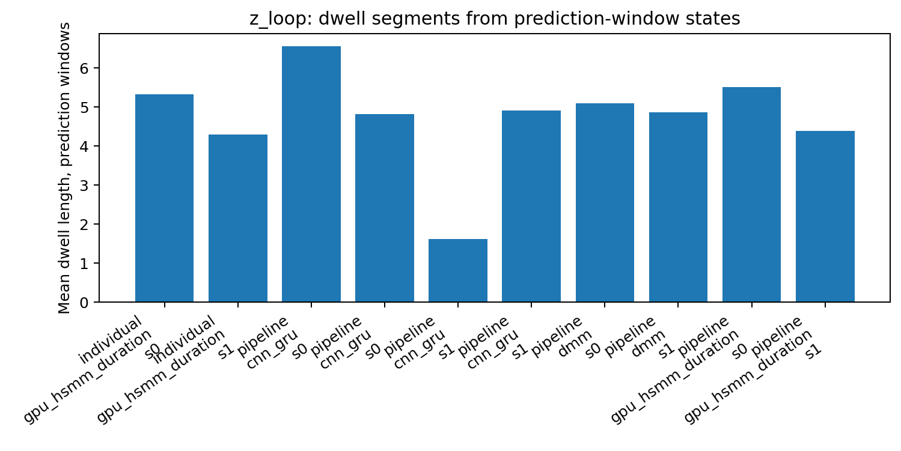

## Training metrics

Training metrics provide baseline/ablation context for the individual models and downstream pipeline stages. Missing prediction exports do not prevent training metrics from being reported.

| bundle     | family   | model               | stage                        |   uses_teacher | test_loss   | best_selection_score   | last_train_loss   | last_val_loss   | best_val_loss   | metrics_csv_rows   | has_checkpoint   |
|:-----------|:---------|:--------------------|:-----------------------------|---------------:|:------------|:-----------------------|:------------------|:----------------|:----------------|:-------------------|:-----------------|
| individual | parity   | cnn_gru_independent | cnn_gru                      |              0 | 0.00369737  | -0.00367524            | 0.00566296        | 0.00825355      | 0.00367524      | 8                  | True             |
| individual | parity   | dmm                 | dmm                          |              0 | 0.0280639   | -0.0280766             | 0.0390683         | 0.0282866       | 0.0280766       | 15                 | True             |
| individual | parity   | gpu_hsmm_duration   | hsmm                         |            nan | N/A         | N/A                    | N/A               | N/A             | N/A             | N/A                | True             |
| pipeline   | parity   | cnn_gru             | 02_cnn_gru_independent       |              0 | 0.00366489  | -0.0036778             | 0.00506181        | 0.00965764      | 0.0036778       | 8                  | True             |
| pipeline   | parity   | cnn_gru             | 03_cnn_gru_teacher_assisted  |              1 | 0.020323    | 0.918498               | 0.0145973         | 0.0203753       | 0.0145857       | 20                 | True             |
| pipeline   | parity   | dmm                 | 05_dmm                       |              1 | 0.0303994   | 0.999366               | 0.0562215         | 0.0304098       | 0.0304098       | 20                 | True             |
| pipeline   | parity   | gpu_hsmm_duration   | 04_hsmm_using_cnn_embeddings |            nan | N/A         | N/A                    | N/A               | N/A             | N/A             | N/A                | True             |
| individual | x_loop   | cnn_gru_independent | cnn_gru                      |              0 | 0.00332987  | -0.0033226             | 0.00856381        | 0.00381129      | 0.0033226       | 18                 | True             |
| individual | x_loop   | dmm                 | dmm                          |              0 | 0.0281345   | -0.0281504             | 0.0390028         | 0.0281748       | 0.0281504       | 19                 | True             |
| individual | x_loop   | gpu_hsmm_duration   | hsmm                         |            nan | N/A         | N/A                    | N/A               | N/A             | N/A             | N/A                | True             |
| pipeline   | x_loop   | cnn_gru             | 02_cnn_gru_independent       |              0 | 0.00324042  | -0.00323833            | 0.00841357        | 0.00393675      | 0.00323833      | 17                 | True             |
| pipeline   | x_loop   | cnn_gru             | 03_cnn_gru_teacher_assisted  |              1 | 0.00469531  | 0.909288               | 0.00753521        | 0.00481913      | 0.00330531      | 20                 | True             |
| pipeline   | x_loop   | dmm                 | 05_dmm                       |              0 | 0.0280408   | -0.0280512             | 0.0392559         | 0.0282548       | 0.0280512       | 20                 | True             |
| pipeline   | x_loop   | gpu_hsmm_duration   | 04_hsmm_using_cnn_embeddings |            nan | N/A         | N/A                    | N/A               | N/A             | N/A             | N/A                | True             |
| individual | z_loop   | cnn_gru_independent | cnn_gru                      |              0 | 0.020648    | -0.020613              | 0.0433888         | 0.020613        | 0.020613        | 20                 | True             |
| individual | z_loop   | dmm                 | dmm                          |              0 | 0.0303076   | -0.0302746             | 0.0486203         | 0.0302746       | 0.0302746       | 20                 | True             |
| individual | z_loop   | gpu_hsmm_duration   | hsmm                         |            nan | N/A         | N/A                    | N/A               | N/A             | N/A             | N/A                | True             |
| pipeline   | z_loop   | cnn_gru             | 02_cnn_gru_independent       |              0 | 0.0188586   | -0.0186039             | 0.0402376         | 0.0186039       | 0.0186039       | 20                 | True             |
| pipeline   | z_loop   | cnn_gru             | 03_cnn_gru_teacher_assisted  |              1 | 0.0454105   | 0.841223               | 0.0574359         | 0.0303515       | 0.0303515       | 13                 | True             |
| pipeline   | z_loop   | dmm                 | 05_dmm                       |              1 | 0.0373044   | 0.89359                | 0.0573416         | 0.0372501       | 0.0372501       | 20                 | True             |
| pipeline   | z_loop   | gpu_hsmm_duration   | 04_hsmm_using_cnn_embeddings |            nan | N/A         | N/A                    | N/A               | N/A             | N/A             | N/A                | True             |

## Interpretation notes

| section       | bundle     | family   | model   | finding                                                                                          | interpretation                                                                                                         |
|:--------------|:-----------|:---------|:--------|:-------------------------------------------------------------------------------------------------|:-----------------------------------------------------------------------------------------------------------------------|
| scope         | nan        | nan      | nan     | The extraction covers both pipeline and individual artifact bundles by default.                  | Use pipeline as the connected QCVV workflow and individual as independent baselines/ablation evidence.                 |
| limits        | nan        | nan      | nan     | Model artifacts do not include physical calibration labels or raw timing metadata by themselves. | Absolute readout fidelity, seconds-scale lifetimes, QND repeatability, and measurement backaction require direct data. |
| model_quality | pipeline   | parity   | cnn_gru | Low confidence and near-single-state occupancy.                                                  | Treat this model as a weak baseline, not a final decoder.                                                              |
| model_quality | pipeline   | x_loop   | cnn_gru | Low confidence and near-single-state occupancy.                                                  | Treat this model as a weak baseline, not a final decoder.                                                              |
| model_quality | pipeline   | x_loop   | dmm     | Low confidence and near-single-state occupancy.                                                  | Treat this model as a weak baseline, not a final decoder.                                                              |
| model_quality | pipeline   | z_loop   | cnn_gru | Low confidence and near-single-state occupancy.                                                  | Treat this model as a weak baseline, not a final decoder.                                                              |
| scorecard     | pipeline   | parity   | nan     | readiness score = 95.61                                                                          | strong model-assisted characterization                                                                                 |
| scorecard     | pipeline   | x_loop   | nan     | readiness score = 78.67                                                                          | usable model-assisted characterization                                                                                 |
| scorecard     | pipeline   | z_loop   | nan     | readiness score = 88.72                                                                          | strong model-assisted characterization                                                                                 |
| scorecard     | individual | parity   | nan     | readiness score = 99.55                                                                          | strong model-assisted characterization                                                                                 |
| scorecard     | individual | x_loop   | nan     | readiness score = 85.23                                                                          | strong model-assisted characterization                                                                                 |
| scorecard     | individual | z_loop   | nan     | readiness score = 94.27                                                                          | strong model-assisted characterization                                                                                 |

## Direct data still needed for physical QCVV

The current artifacts support model-derived characterization. The following are required for stronger physical QCVV claims.

| need                                                                                                  | why                                                                                                                                                    | status                                                                                    | how_to_use                                                                                         |
|:------------------------------------------------------------------------------------------------------|:-------------------------------------------------------------------------------------------------------------------------------------------------------|:------------------------------------------------------------------------------------------|:---------------------------------------------------------------------------------------------------|
| physical timestep dt for each family                                                                  | Converts tau_0/tau_1 and dwell-window statistics from model units into seconds.                                                                        | missing                                                                                   | Pass --dt-json dt.json with keys parity, x_loop, z_loop.                                           |
| calibration labels or known state preparations                                                        | Maps hidden state 0/1 to even/odd parity or physical X/Z loop states and enables true assignment error/readout fidelity.                               | missing                                                                                   | Pass --state-label-json for state names and use qcvv_calibrate.py for confusion matrices/fidelity. |
| raw or prepared I/Q traces with sample_dt and run/time metadata                                       | Needed for physical drift analysis, raw trace dwell-time posteriors, repeated-readout/QND metrics, and model inference on new data.                    | not available in extracted model artifacts unless prepared bundles are accessible locally | Keep columns such as family, run_id, sequence_id, sample_index, t, I, Q, sample_dt.                |
| repeated-readout or pre/post measurement experiments                                                  | Needed to quantify measurement backaction and QND repeatability rather than only decoder confidence.                                                   | not inferable from model artifacts alone                                                  | Prepare paired pre/post or repeated measurements and align them by run/sequence/time.              |
| individual CNN-GRU/DMM prediction exports if you want prediction-level comparison for those baselines | The individual bundle has checkpoints and training metrics for some neural models, but no prediction NPZ for CNN-GRU/DMM in the current project files. | missing when prediction_npz is blank in artifact_inventory.csv                            | Run model inference/export on a shared held-out dataset, then rerun qcvv_extract.py.               |

## Generated files

- `artifact_inventory`: `C:\Users\ethan\CodingSchool\CMPE 188\Majorana-MLQT-Project-EthanVu-CMPE188\qcvv_outputs\artifact_inventory.csv`

- `cthmm_lifetimes`: `C:\Users\ethan\CodingSchool\CMPE 188\Majorana-MLQT-Project-EthanVu-CMPE188\qcvv_outputs\cthmm_lifetimes.csv`

- `prediction_metrics`: `C:\Users\ethan\CodingSchool\CMPE 188\Majorana-MLQT-Project-EthanVu-CMPE188\qcvv_outputs\prediction_metrics.csv`

- `model_agreements`: `C:\Users\ethan\CodingSchool\CMPE 188\Majorana-MLQT-Project-EthanVu-CMPE188\qcvv_outputs\model_agreements.csv`

- `cross_bundle_model_agreements`: `C:\Users\ethan\CodingSchool\CMPE 188\Majorana-MLQT-Project-EthanVu-CMPE188\qcvv_outputs\cross_bundle_model_agreements.csv`

- `dwell_metrics`: `C:\Users\ethan\CodingSchool\CMPE 188\Majorana-MLQT-Project-EthanVu-CMPE188\qcvv_outputs\dwell_metrics.csv`

- `training_metrics`: `C:\Users\ethan\CodingSchool\CMPE 188\Majorana-MLQT-Project-EthanVu-CMPE188\qcvv_outputs\training_metrics.csv`

- `bundle_comparison`: `C:\Users\ethan\CodingSchool\CMPE 188\Majorana-MLQT-Project-EthanVu-CMPE188\qcvv_outputs\bundle_comparison.csv`

- `family_summary`: `C:\Users\ethan\CodingSchool\CMPE 188\Majorana-MLQT-Project-EthanVu-CMPE188\qcvv_outputs\family_summary.csv`

- `qcvv_scorecard`: `C:\Users\ethan\CodingSchool\CMPE 188\Majorana-MLQT-Project-EthanVu-CMPE188\qcvv_outputs\qcvv_scorecard.csv`

- `interpretation_notes`: `C:\Users\ethan\CodingSchool\CMPE 188\Majorana-MLQT-Project-EthanVu-CMPE188\qcvv_outputs\interpretation_notes.csv`

- `extraction_warnings`: `C:\Users\ethan\CodingSchool\CMPE 188\Majorana-MLQT-Project-EthanVu-CMPE188\qcvv_outputs\extraction_warnings.csv`

- `direct_data_needed`: `C:\Users\ethan\CodingSchool\CMPE 188\Majorana-MLQT-Project-EthanVu-CMPE188\qcvv_outputs\direct_data_needed.csv`

### Figures

- `C:\Users\ethan\CodingSchool\CMPE 188\Majorana-MLQT-Project-EthanVu-CMPE188\qcvv_outputs\figures\cthmm_lifetimes_pipeline_vs_individual.png`

- `C:\Users\ethan\CodingSchool\CMPE 188\Majorana-MLQT-Project-EthanVu-CMPE188\qcvv_outputs\figures\cthmm_lifetime_bundle_ratio.png`

- `C:\Users\ethan\CodingSchool\CMPE 188\Majorana-MLQT-Project-EthanVu-CMPE188\qcvv_outputs\figures\parity_prediction_confidence_all_bundles.png`

- `C:\Users\ethan\CodingSchool\CMPE 188\Majorana-MLQT-Project-EthanVu-CMPE188\qcvv_outputs\figures\x_loop_prediction_confidence_all_bundles.png`

- `C:\Users\ethan\CodingSchool\CMPE 188\Majorana-MLQT-Project-EthanVu-CMPE188\qcvv_outputs\figures\z_loop_prediction_confidence_all_bundles.png`

- `C:\Users\ethan\CodingSchool\CMPE 188\Majorana-MLQT-Project-EthanVu-CMPE188\qcvv_outputs\figures\parity_state_occupancy_all_bundles.png`

- `C:\Users\ethan\CodingSchool\CMPE 188\Majorana-MLQT-Project-EthanVu-CMPE188\qcvv_outputs\figures\x_loop_state_occupancy_all_bundles.png`

- `C:\Users\ethan\CodingSchool\CMPE 188\Majorana-MLQT-Project-EthanVu-CMPE188\qcvv_outputs\figures\z_loop_state_occupancy_all_bundles.png`

- `C:\Users\ethan\CodingSchool\CMPE 188\Majorana-MLQT-Project-EthanVu-CMPE188\qcvv_outputs\figures\parity_individual_model_agreement_heatmap.png`

- `C:\Users\ethan\CodingSchool\CMPE 188\Majorana-MLQT-Project-EthanVu-CMPE188\qcvv_outputs\figures\x_loop_individual_model_agreement_heatmap.png`

- `C:\Users\ethan\CodingSchool\CMPE 188\Majorana-MLQT-Project-EthanVu-CMPE188\qcvv_outputs\figures\z_loop_individual_model_agreement_heatmap.png`

- `C:\Users\ethan\CodingSchool\CMPE 188\Majorana-MLQT-Project-EthanVu-CMPE188\qcvv_outputs\figures\parity_pipeline_model_agreement_heatmap.png`

- `C:\Users\ethan\CodingSchool\CMPE 188\Majorana-MLQT-Project-EthanVu-CMPE188\qcvv_outputs\figures\x_loop_pipeline_model_agreement_heatmap.png`

- `C:\Users\ethan\CodingSchool\CMPE 188\Majorana-MLQT-Project-EthanVu-CMPE188\qcvv_outputs\figures\z_loop_pipeline_model_agreement_heatmap.png`

- `C:\Users\ethan\CodingSchool\CMPE 188\Majorana-MLQT-Project-EthanVu-CMPE188\qcvv_outputs\figures\cross_bundle_same_model_agreement.png`

- `C:\Users\ethan\CodingSchool\CMPE 188\Majorana-MLQT-Project-EthanVu-CMPE188\qcvv_outputs\figures\parity_dwell_windows_all_bundles.png`

- `C:\Users\ethan\CodingSchool\CMPE 188\Majorana-MLQT-Project-EthanVu-CMPE188\qcvv_outputs\figures\x_loop_dwell_windows_all_bundles.png`

- `C:\Users\ethan\CodingSchool\CMPE 188\Majorana-MLQT-Project-EthanVu-CMPE188\qcvv_outputs\figures\z_loop_dwell_windows_all_bundles.png`

- `C:\Users\ethan\CodingSchool\CMPE 188\Majorana-MLQT-Project-EthanVu-CMPE188\qcvv_outputs\figures\qcvv_model_readiness_scorecard.png`

- `C:\Users\ethan\CodingSchool\CMPE 188\Majorana-MLQT-Project-EthanVu-CMPE188\qcvv_outputs\figures\bundle_ratio_mean_confidence.png`

- `C:\Users\ethan\CodingSchool\CMPE 188\Majorana-MLQT-Project-EthanVu-CMPE188\qcvv_outputs\figures\bundle_ratio_mean_entropy_bits.png`

- `C:\Users\ethan\CodingSchool\CMPE 188\Majorana-MLQT-Project-EthanVu-CMPE188\qcvv_outputs\figures\bundle_ratio_state_0_occupancy.png`

- `C:\Users\ethan\CodingSchool\CMPE 188\Majorana-MLQT-Project-EthanVu-CMPE188\qcvv_outputs\figures\bundle_ratio_state_1_occupancy.png`

- `C:\Users\ethan\CodingSchool\CMPE 188\Majorana-MLQT-Project-EthanVu-CMPE188\qcvv_outputs\figures\bundle_ratio_tau_mean_model_units.png`
